

# Visitor Management Platform

### Built for **Jalalabad Gas Transmission & Distribution System Limited**

*A production-style visitor operations system: reception, approvals, gate control, and audit-ready oversight—without the chaos of paper logs and scattered messages.*

 

[**Discuss a similar build →**](https://mugneeit.com)

---

## At a glance

| | |
|:---|:---|
| **Ideal for** | Utilities, regulated infrastructure, public-sector sites, and any organization where **visitor access must be explicit, approved, and traceable** |
| **What it replaces** | Manual registers, ad-hoc calls, unclear accountability, and slow approval loops |
| **What leadership sees** | **Faster reception**, **clear officer decisions**, **exportable history**, and **defensible records** when questions arise |
| **How it is delivered** | **Tailored to your process**—not a forced template—with room for **ongoing support** and **full source ownership** where agreed |

---

## Why this matters for your business

> **Visitors are a front-door risk and a front-desk bottleneck.** When intake, approval, and gate actions live in one coherent system, you reduce ambiguity, shorten wait times, and strengthen the story you can tell auditors and regulators.

**Outcomes owners care about**

- **Operational clarity** — One live picture of who is expected, who approved entry, and where each visit sits in the lifecycle.
- **Faster, calmer reception** — Structured intake (including optional **QR self-service**) cuts repetition and keeps peak-hour lines manageable.
- **Accountable approvals** — Destination officials see requests quickly—**in the app, by email, and via WhatsApp**—and can act with notes and timing that stay on record.
- **Controlled entry** — Check-in and checkout align with approval and guest-card discipline, so “who is on site” matches policy.
- **Governance without guesswork** — **Reports** and **audit logs** support reviews, handovers, and compliance conversations with evidence—not memory.

---

## The experience we designed

**Jalalabad Gas Transmission and Distribution System Limited** needed more than digitized paperwork: a dependable way to connect **reception**, **approving officers**, and **HR administration** in a single, role-aware portal.

The result is a **premium, enterprise-appropriate interface**—calm typography, decisive primary actions, and screens tuned for daily high-volume use. The same design principles translate to other **utilities, industrial campuses, and public-sector** environments where reception and security expectations run high.

---

## Capabilities by stakeholder

<table>
<tr>
<td width="33%" valign="top">

### Reception & gate

- Secure sign-in for reception roles  
- **Today’s queue** with search and status filters  
- **New visit** intake (identity, purpose, timing, photo, guest card / RFID context)  
- Optional **QR-based visitor self-service**—no visitor login required  
- **Check-in / checkout** aligned to approval and policy  

</td>
<td width="33%" valign="top">

### Approving officers

- **Inbox-style** pending work  
- **Visit review** with context-rich summary  
- Approve / reject with **notes** and **schedule adjustments**  
- **Actionable notifications** and secure approval paths</td>
<td width="33%" valign="top">

### HR & administration

- **Employees** and **departments** with practical CRUD controls  
- **Bulk import** where high-volume HR maintenance is required  
- **Filtered reports** and **spreadsheet-friendly export**  
- **Audit logging** for material changes and accountability  

</td>
</tr>
</table>

---

## Visitor journey (end-to-end)

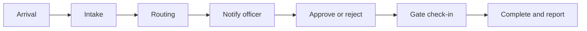

<strong>Step-by-step (expand)</strong>

1. **Arrival** — Reception registers the visitor **or** the visitor completes a **QR-led** request on their own device.  
2. **Routing** — The visit is tied to the correct **department** and **destination official**.  
3. **Awareness** — The officer is reached through the **dashboard**, **email**, and **WhatsApp**.  
4. **Decision** — Approve or reject—with optional notes, reasons, and timing updates.  
5. **Gate control** — Reception progresses **check-in** and **checkout** in line with approval and guest-card process.  
6. **Oversight** — HR runs **reports**, maintains **structure**, and reviews **audit history** when needed.  

---

## Delivery philosophy

We do not position this as a generic SaaS checkbox exercise.

| Principle | What it means for you |
|-----------|------------------------|
| **Workflow-first** | Screens and rules follow **how you already operate**—then we refine—not the other way around. |
| **Commercial clarity** | This class of delivery is structured as a **one-time solution** rather than an open-ended subscription story (*terms agreed per engagement*). |
| **Continuity** | After go-live, **support, enhancements, and maintenance** can stay with the same team that built it. |
| **Ownership** | **Full source code** can be part of the commercial arrangement when clients want long-term control (*this public page is not a source release—see notice below*). |

---

## Product tour

*Representative interface captures from the client proposal and solution documentation.*

 

### Sign-in — role-based entry

  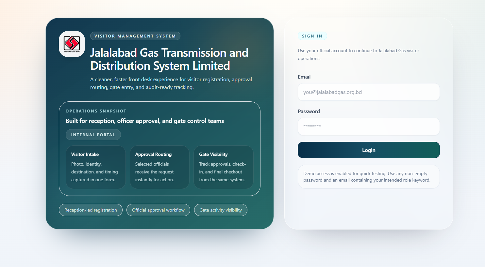

<em>Secure entry for reception, officer, and admin roles.</em>

### Reception — today’s queue

  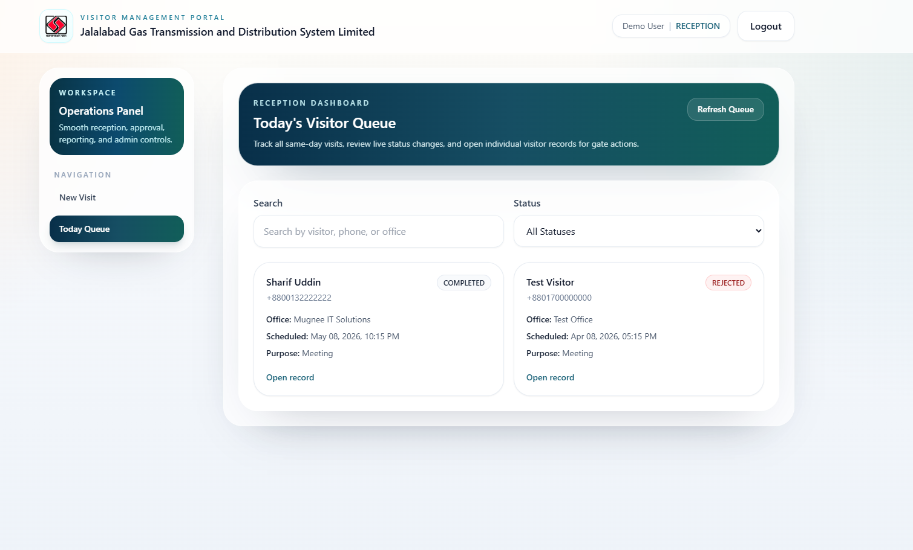

<em>Same-day visibility: search, status, and fast access to each record.</em>

### Reception — new visit

  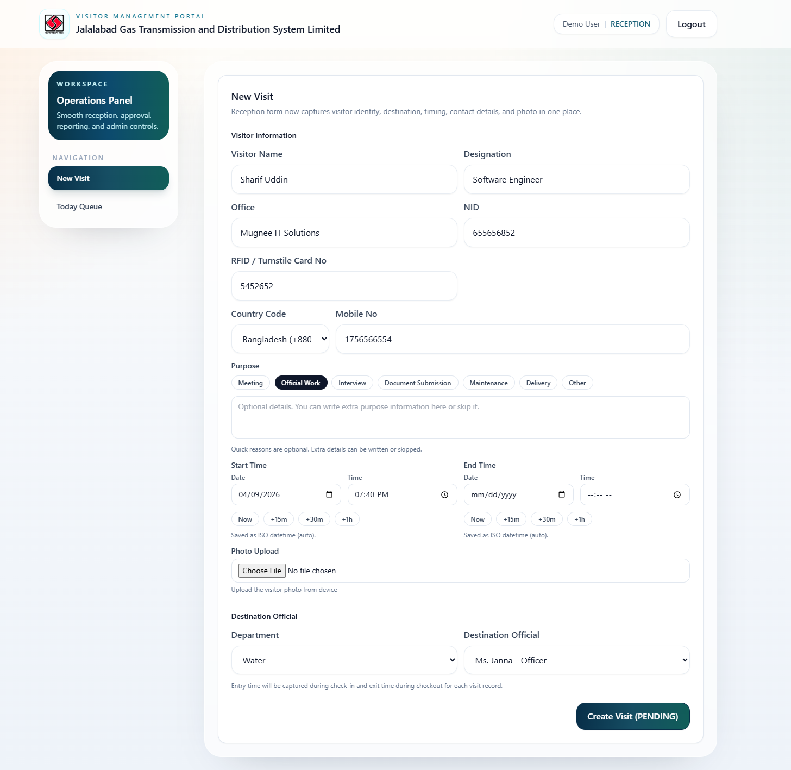

<em>Structured intake: profile, purpose, timing, media, routing, and guest-card context.</em>

### Officer — visit review

  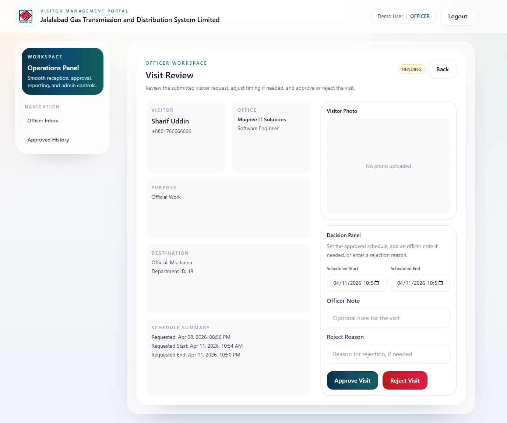

<em>Decisions happen with full context—notes, timing, approve or reject.</em>

### Notifications that drive action

  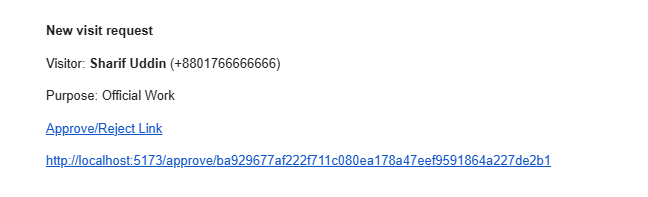

<em>Officials receive concise alerts so approvals are not “lost in the inbox.”</em>

### Reception — detail & gate actions

  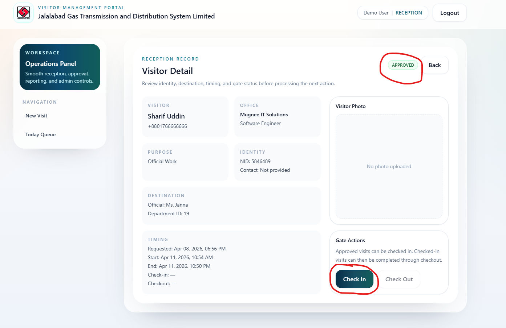

<em>Approved visits move forward with clear gate progression.</em>

### Administration — employees

  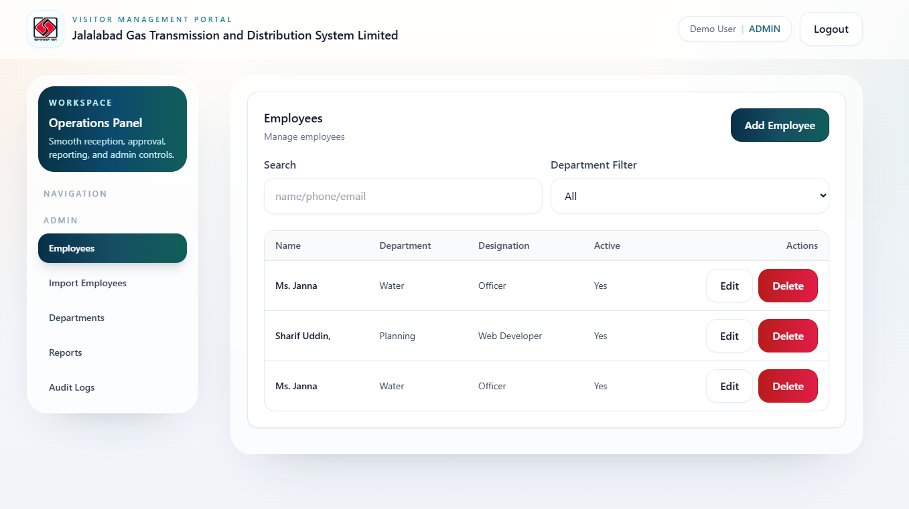

<em>Directory maintenance that keeps routing accurate.</em>

### Administration — departments

  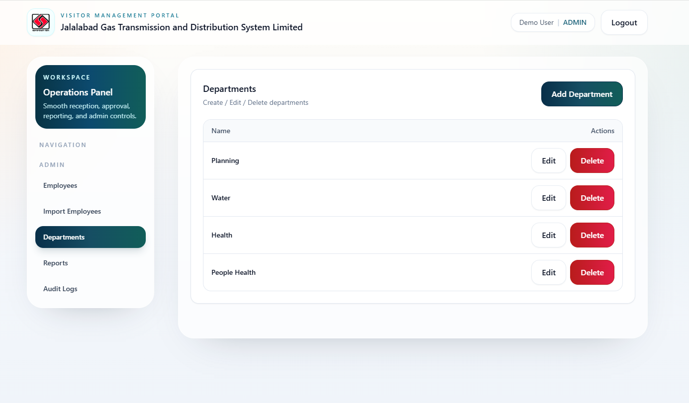

<em>Organizational structure that reporting and workflows depend on.</em>

### Reports & export

  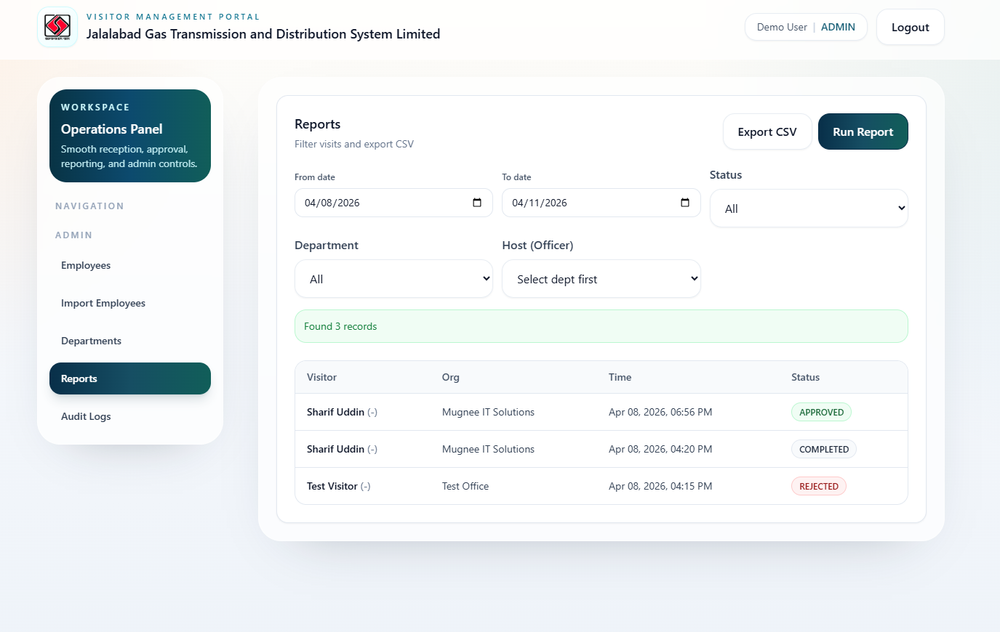

<em>Filter, run, and export for operations reviews and documentation.</em>

### Audit trail

  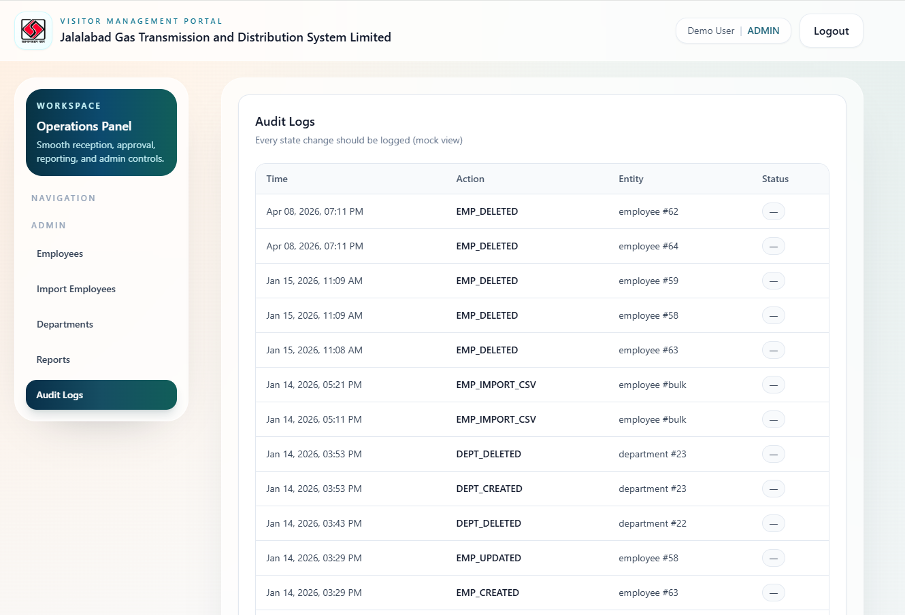

<em>Activity history that supports transparency and governance.</em>

---

## Solution architecture (non-technical)

- **Web application** — A focused, role-aware portal for reception, officers, and administrators.  
- **Application services** — Secure APIs that enforce **who can do what**, consistently.  
- **Database** — Durable records for visits, structure, users, reporting, and audit events.  
- **Notifications** — Connectors for **email** and **WhatsApp** (and similar channels as agreed) so decisions are not browser-bound.  

<strong>Technology reference (for IT stakeholders)</strong>

| Layer | Stack |
|--------|--------|
| Client | React, Vite |
| UI | Tailwind CSS |
| API | Node.js, Express |
| Data | PostgreSQL |
| Integrations | Validated payloads; messaging and email connectors |

*Exact versions and internal modules are not disclosed in this showcase.*

---

## Extended documentation

The full **proposal / solution narrative** (including detailed workflow copy and figure references) lives in the repository:

**`docs/Visitor Management System.docx`**

---

## Important notice — source & confidentiality

**Source code, database schemas, credentials, and deployment specifics are not published here.** They remain private for **security**, **client confidentiality**, and **commercial** reasons.

This repository is a **curated portfolio exhibit** only. Deeper technical materials are shared with qualified prospects under appropriate confidentiality.

---

## Mugnee IT Solution

**Custom software for teams that cannot afford fragile tools or vague vendors.**

[**mugneeit.com**](https://mugneeit.com)

 

*If you are responsible for reception, security, or HR operations and want a system that matches your standards—not a generic portal—**start a conversation on the site above**.*

 

Showcase only: screenshots and documentation; no runnable application or secrets included.

